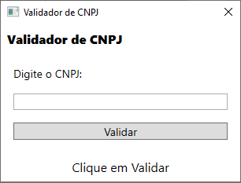
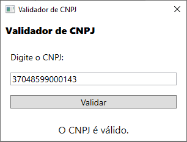
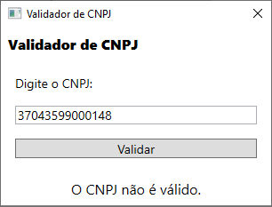

# Validador de CNPJ

> Aplicativo de demonstração de uso da biblioteca ValidaCNPJCore

Este é um aplicativo WPF .NET Core que demonstra o consumo e uso da biblioteca [ValidaCNPJCore](https://github.com/jotaantoniosantana/ValidaCNPJCore).

| Tela inicial                  | CNPJ válido                | CNPJ inválido                |
|:-----------------------------:|:--------------------------:|:----------------------------:|
||||

## Como Obter

1. Abra um terminal
1. `git clone https://github.com/jotaantoniosantana/ValidaCNPJApp.git`
1. `cd ValidaCNPJApp`
1. `dotnet run -c Release --project .\src\ValidaCNPJApp\ValidaCNPJApp.csproj`
1. O aplicativo será executado em sua máquina local

Se quiser compilá-lo, use o comando `dotnet build -c Release --project .\src\ValidaCNPJApp\ValidaCNPJApp.csproj` e procure pelo executável em `ValidaCNPJApp\src\ValidaCNPJApp\bin\Release\netcoreapp3.1`.

Ou ainda, verifique o [GitHub Releases](https://github.com/jotaantoniosantana/ValidaCNPJApp/releases) para baixar o executável. **NOTA:** Sua suíte de segurança pode falsamente identificar o programa como vírus por causa da baixa quantidade de downloads. [O aplicativo é seguro e livre de vírus](https://www.virustotal.com/gui/file/26c828c1dab9ba3e6a1feda537492fe8280cc05b33a6b51a6c5f6a2013112f0f/detection); porém, se isso acontecer, [abra um problema](https://github.com/jotaantoniosantana/ValidaCNPJApp/issues/new) informando sua suíte de segurança para que possamos providenciar seu whitelisting.

## Licença

MIT.
